# Basket
Basket is a minimalist grocery list app built with Flutter and Firebase. It lets you organize shopping items by store, check them off as you go, and keeps everything synced across devices.

## ✨ Features

- 🏪 Organize items by store
- ➕ Add and remove items with ease
- ✅ Check off completed items
- 🗑️ Automatically deletes empty store lists
- 🔐 Sign up and sign in with Firebase Auth
- 🔥 Sync data with Firestore in real-time
- 🌗 Supports light and dark mode

## 📸 Screenshots

  
Click to expand screenshots (light + dark)

   

  ### 🏠 Home
  <table>
    <tr>
      <td><strong>Light</strong></td>
      <td><strong>Dark</strong></td>
    </tr>
    <tr>
      <td>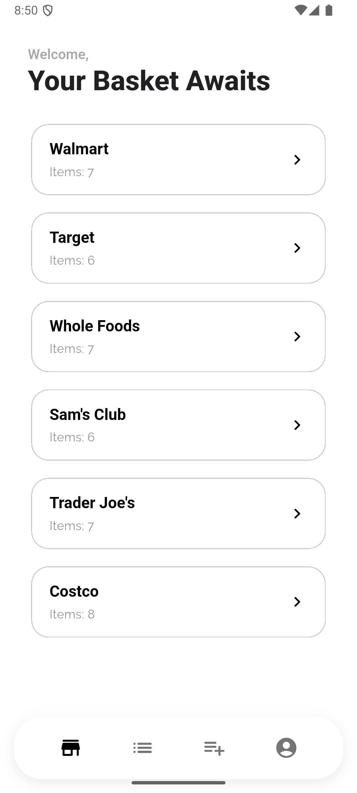</td>
      <td>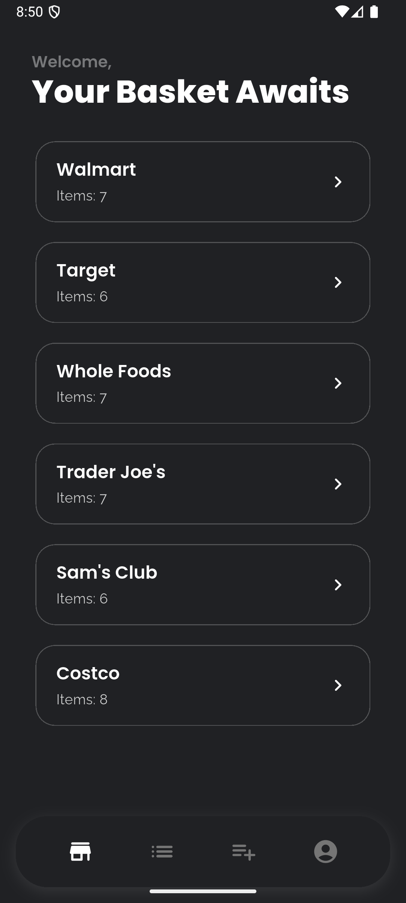</td>
    </tr>
  </table>

  ### 🔐 Login
  <table>
    <tr>
      <td><strong>Light</strong></td>
      <td><strong>Dark</strong></td>
    </tr>
    <tr>
      <td>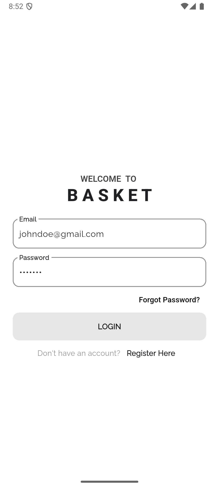</td>
      <td>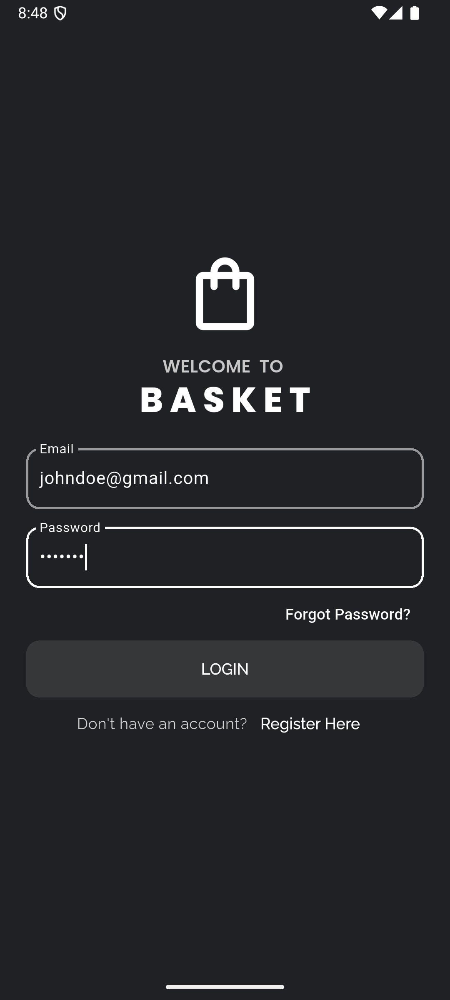</td>
    </tr>
  </table>

  ### 📝 Register
  <table>
    <tr>
      <td><strong>Light</strong></td>
      <td><strong>Dark</strong></td>
    </tr>
    <tr>
      <td>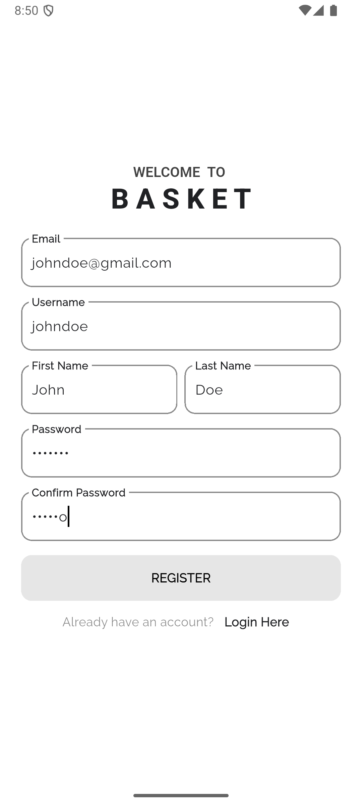</td>
      <td>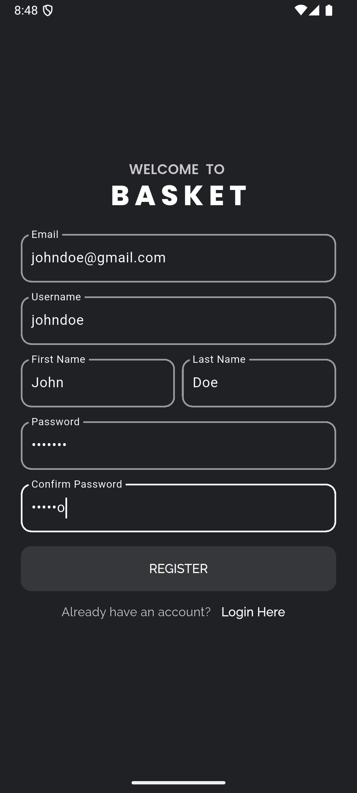</td>
    </tr>
  </table>

  ### 👤 Account
  <table>
    <tr>
      <td><strong>Light</strong></td>
      <td><strong>Dark</strong></td>
    </tr>
    <tr>
      <td>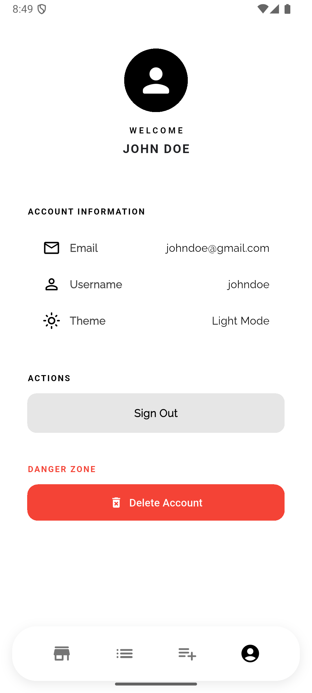</td>
      <td>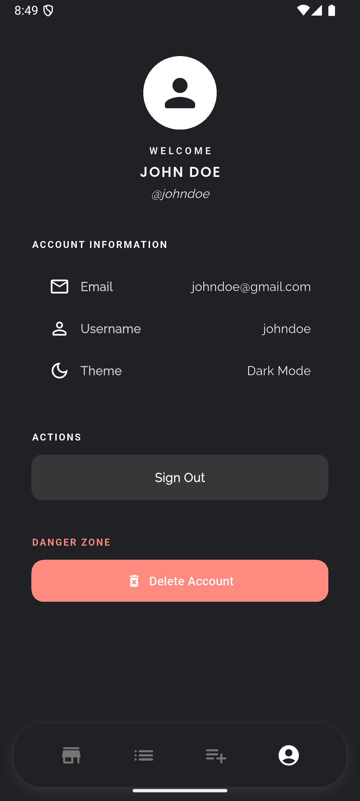</td>
    </tr>
  </table>

  ### ➕ New
  <table>
    <tr>
      <td><strong>Light</strong></td>
      <td><strong>Dark</strong></td>
    </tr>
    <tr>
      <td>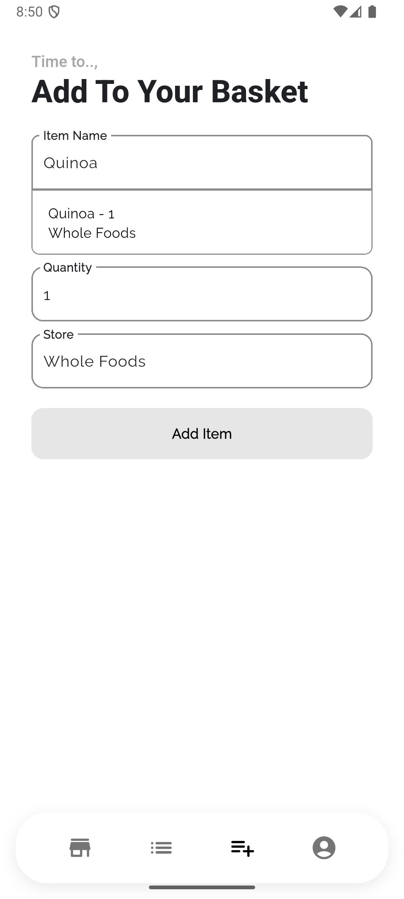</td>
      <td>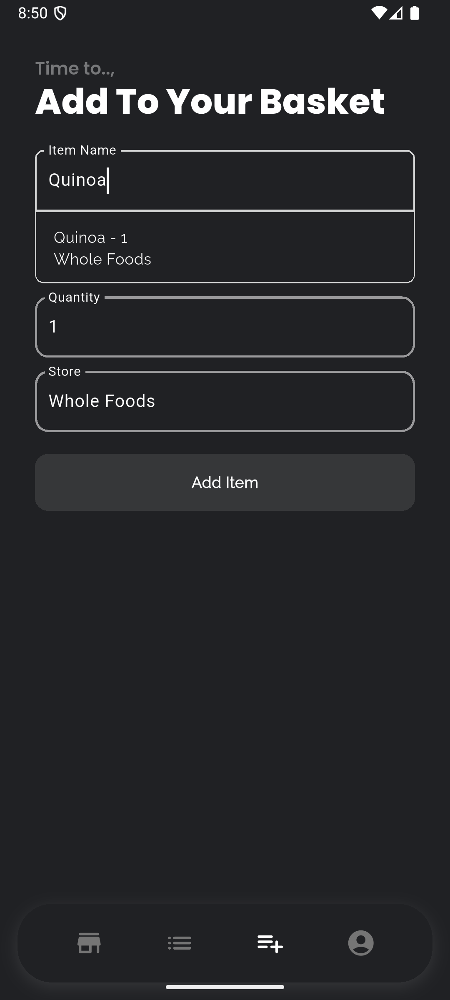</td>
    </tr>
  </table>

  ### 🛒 List
  <table>
    <tr>
      <td><strong>Light</strong></td>
      <td><strong>Dark</strong></td>
    </tr>
    <tr>
      <td>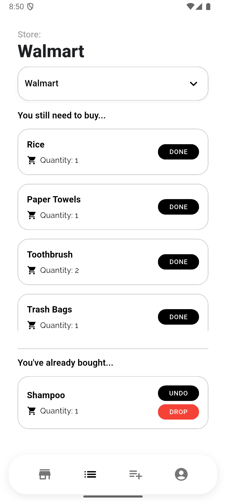</td>
      <td>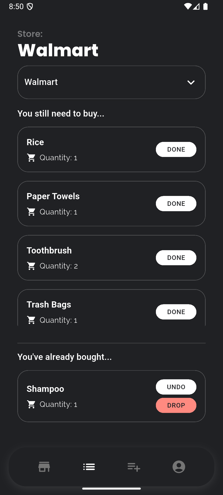</td>
    </tr>
  </table>

  ### 📋 All Items
  <table>
    <tr>
      <td><strong>Light</strong></td>
      <td><strong>Dark</strong></td>
    </tr>
    <tr>
      <td></td>
      <td></td>
    </tr>
  </table>

